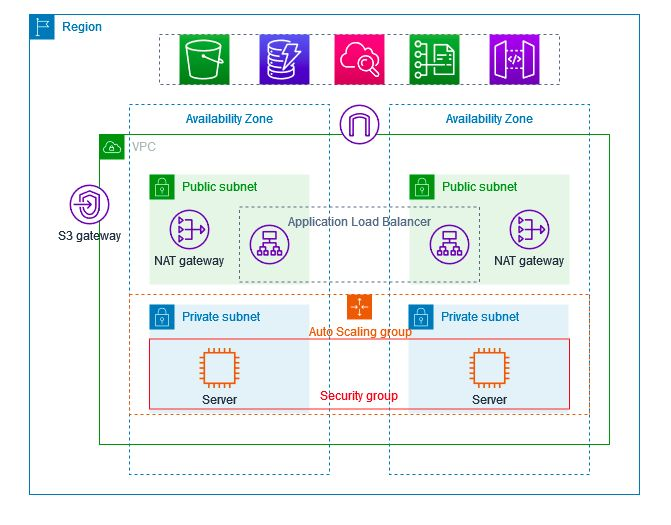

# AWS VPC Architecture with ALB, Auto Scaling Group, NAT Gateway & Bastion Host



This guide walks you through creating a **Highly Available Architecture in AWS** using **VPC and more**:

✅ Key Components:

* VPC across **2 Availability Zones**
* **2 Public Subnets + 2 Private Subnets**
* **NAT Gateways** (1 per AZ in public subnets)
* **Auto Scaling Group** in private subnets with Launch Template
* **Bastion Host** for secure SSH access
* **Application Load Balancer (ALB)** in public subnets, serving traffic to private instances

---

## ✅ Architecture Overview

* **Public Subnets**: For ALB and NAT Gateways
* **Private Subnets**: For EC2 Auto Scaling instances
* **Bastion Host**: Jump server for SSH into private instances
* **Security Groups**:

  * ALB SG → allows HTTP(80) from internet
  * Private SG → allows **port 8000** from ALB and **SSH from Bastion**
  * Bastion SG → allows **SSH (22)** from your IP
* **Load Balancer** on port 80 forwards to EC2 instances running **Python HTTP server on port 8000**

---

## 🛠 Step 1: Create VPC

1. Go to **VPC > Create VPC**
2. Name: `MyVPC`
3. IPv4 CIDR: `10.0.0.0/16`
4. **Create VPC**

---

## 🛠 Step 2: Create Subnets

* **4 Subnets**:

  * **Public Subnet 1**: `10.0.1.0/24` (AZ1)
  * **Public Subnet 2**: `10.0.2.0/24` (AZ2)
  * **Private Subnet 1**: `10.0.3.0/24` (AZ1)
  * **Private Subnet 2**: `10.0.4.0/24` (AZ2)

✔ Enable **Auto-assign public IP** ONLY for public subnets.

---

## 🛠 Step 3: Internet Gateway & Route Tables

1. Create **Internet Gateway** → Attach to VPC
2. Create **Public Route Table**:

   * Add route `0.0.0.0/0` → Internet Gateway
   * Associate with Public Subnets
3. Create **Private Route Table**:

   * Will add NAT route after NAT creation

---

## 🛠 Step 4: NAT Gateways

1. Allocate **2 Elastic IPs**
2. Create NAT Gateways:

   * NAT 1 in Public Subnet 1
   * NAT 2 in Public Subnet 2
3. Update **Private Route Table**:

   * Add `0.0.0.0/0` → NAT Gateway (for each AZ)

---

## 🛠 Step 5: Security Groups

### **ALB Security Group**

* **Inbound**: HTTP (80) from Anywhere (0.0.0.0/0)
* **Outbound**: All traffic

### **Private EC2 Security Group**

* **Inbound**:

  * Port 8000 from ALB SG
  * SSH (22) from Bastion SG
* **Outbound**: All traffic

### **Bastion SG**

* **Inbound**:

  * SSH (22) from your IP
* **Outbound**: All traffic

---

## 🛠 Step 6: Bastion Host Setup

1. Launch EC2 in **Public Subnet**
2. Attach **Bastion SG**
3. Connect via SSH:

```bash
scp -i ec2-new.pem ec2-new.pem ec2-user@<Bastion-Public-IP>:/home/ec2-user/
ssh -i ec2-new.pem ec2-user@<Bastion-Public-IP>
```

---

## 🛠 Step 7: Launch Template & Auto Scaling Group

### **Launch Template**

* AMI: Amazon Linux 2
* Instance Type: t2.micro
* Security Group: Private SG
* **No public IP**
* User Data:

```bash
#!/bin/bash
yum update -y
yum install python3 -y
echo "<html><h1>My Pvt Subnet $(hostname)</h1></html>" > /home/ec2-user/index.html
```

### **Auto Scaling Group**

* Desired: **2**, Min: **2**, Max: **4**
* Subnets: Private Subnets

---

## 🛠 Step 8: Connect via Bastion

```bash
ssh -i ec2-new.pem ec2-user@<Private-Instance-IP>
cd /home/ec2-user
python3 -m http.server 8000
```

* Instance 1: Modify index.html → `My Pvt Subnet 1`
* Instance 2: Modify index.html → `My Pvt Subnet 2`

---

## 🛠 Step 9: Application Load Balancer

1. Go to **EC2 > Load Balancers > Create ALB**
2. Name: `MyAppALB`
3. Scheme: Internet-facing
4. Listeners: HTTP on port 80
5. Subnets: Public Subnets
6. Security Group: ALB SG

### **Target Group**

* Name: `my-target-group`
* Target type: Instances
* Protocol: HTTP
* Port: 8000
* Register Auto Scaling instances

---

## ✅ Test

* Open `http://<ALB-DNS>` → Should serve from both private instances
* Refresh to see load balancing in action

---
## ✅ Security Group Summary
- **ALB SG** → Allows `HTTP (80)` from Internet  
- **Private SG** → Allows `port 8000` from ALB SG, `SSH (22)` from Bastion SG  
- **Bastion SG** → Allows `SSH (22)` from your IP  

---

## ✅ Recap
- VPC with **2 AZs**, Public & Private Subnets  
- NAT Gateways for internet in Private subnets  
- Auto Scaling Group in private subnet (**2–4 instances**)  
- Bastion Host for secure SSH  
- ALB distributing traffic from `port 80 → port 8000` on instances  
